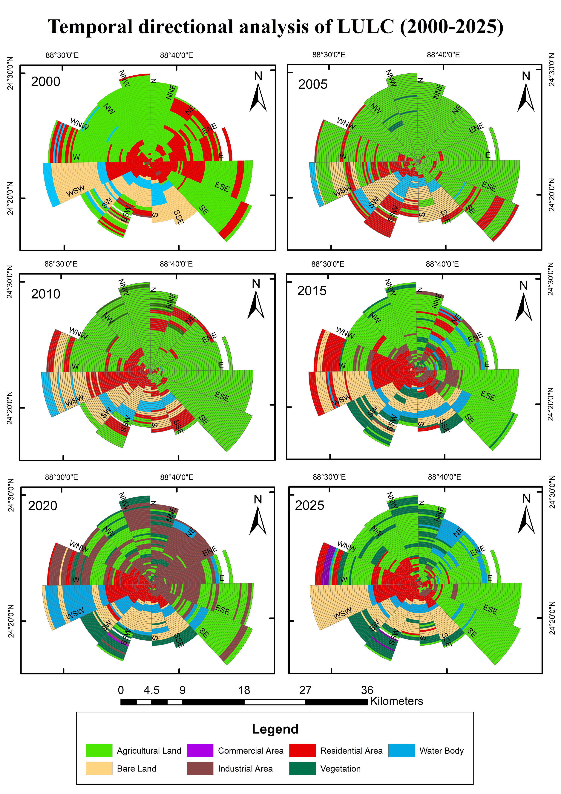

# Temporal Directional Analysis of Land Use Land Cover (2000–2025)

## Overview

This repository presents a **Temporal Directional Analysis of Land Use Land Cover (LULC)** change from **2000 to 2025** within the **Rajshahi Development Authority (RDA) area, Bangladesh**.

The figure above illustrates how different land use categories have changed spatially and directionally over time. The circular diagrams divide the study area into **directional sectors (N, NE, E, SE, S, SW, W, NW)** and **concentric distance zones** from the city center.

Each ring represents a specific **distance from the urban core**, while the colored segments represent different **land use categories**. This visualization helps identify **dominant spatial directions of urban expansion and land transformation** over time.

The analysis highlights patterns such as:

- Expansion of **residential areas**
- Growth of **commercial and industrial zones**
- Reduction of **agricultural land**
- Changes in **vegetation and water bodies**

This directional analysis helps understand **urban growth patterns and spatial development dynamics** in the Rajshahi metropolitan region.

---

# Study Area

The study area is located within the **Rajshahi Development Authority (RDA)** planning region in northwestern Bangladesh.

Rajshahi has experienced rapid **urban expansion, infrastructure development, and land transformation** during the last two decades, making it an important case study for analyzing **urban spatial dynamics and land use changes**.

---

# Methodology

The directional LULC analysis was conducted using **GIS-based spatial analysis techniques** in **ArcMap**.

The workflow involved several geospatial processing steps:

### 1. Preparation of LULC Data
Land Use Land Cover maps were prepared for the following years:

- 2000  
- 2005  
- 2010  
- 2015  
- 2020  
- 2025  

The LULC classes include:

- Agricultural Land  
- Residential Area  
- Commercial Area  
- Industrial Area  
- Vegetation  
- Bare Land  
- Water Body  

---

### 2. Creation of Directional Zones

To analyze spatial patterns, the study area was divided into **directional sectors** and **distance-based rings**.

Key steps included:

- Selecting the **city center as the reference point**
- Creating **concentric buffers using Multiple Ring Buffer**
- Dividing the study area into **directional sectors**

This allowed the identification of **direction-specific land use transformation patterns**.

---

### 3. Spatial Analysis

Several **ArcGIS spatial analysis tools** were used to calculate the distribution of land use types within each zone.

Key GIS tools used:

- **Multiple Ring Buffer**
- **Zonal Statistics**
- **Spatial Analyst Tools**
- **Overlay Analysis**
- **Clip**
- **Intersect**
- **Reclassification**
- **Attribute Table Analysis**

These tools were used to measure the **area and proportion of each LULC class within each directional sector and distance zone**.

---

### 4. Visualization

The final results were visualized using **circular directional diagrams**, showing the **temporal evolution of land use patterns** from **2000 to 2025**.

This visualization technique helps clearly identify:

- Directional urban expansion
- Sector-wise land transformation
- Spatial growth trends of the city

---

# Tools & Software

The analysis was conducted using the following tools:

- **ArcMap (ArcGIS Desktop)**
- Spatial Analyst Extension
- GIS Buffer and Zonal Analysis Tools
- Map Layout and Visualization Tools

---

# Research Context

This analysis was conducted as part of an academic research project titled:

**"Carbon-Conscious Urban Structuring through Land-Specific Carbon Emission"**

The project is financed by the **University Grants Commission (UGC), Bangladesh** and **Rajshahi University of Engineering & Technology (RUET)**.   

Project details include:

- **Project Director:** Md. Naimur Rahman, Lecturer, Department of Urban & Regional Planning (URP), RUET
- **Project Number:** 10 (Ref. No. DRE/08/RUET/764(52)/Pro/2025-26/10) 
- **Income Year:** 2025–2026  
- **Project Duration:** 1 Year  
- **Research Grant Type:** M.Sc. Research Grant  
- **Institution:** Rajshahi University of Engineering & Technology (RUET), Bangladesh  

I contributed to this work as an **Undergraduate Research Assistant**, where I assisted in **spatial analysis, GIS processing, and visualization of land use change patterns**.

---

# Key Insights

The directional analysis reveals several important urban growth trends:

- Significant **residential expansion in eastern and southeastern directions**
- Gradual **conversion of agricultural land into built-up areas**
- Increasing **industrial and commercial development in selected sectors**
- Spatial variations in **vegetation and water body distribution**

Such insights can support **sustainable urban planning and carbon-conscious land management strategies**.

---

# Repository Contents

Directional-LULC
│
├── directional_LULC_RDA.jpg # Directional LULC visualization map
├── README.md # Project documentation
└── LICENSE

---

# Author

**Md. Habibullah Masbah**  
Undergraduate Student  
ID: 2107046
Department of Urban & Regional Planning  
Rajshahi University of Engineering & Technology (RUET)

---

# License

This project is licensed under the **MIT License**.

You are free to use, modify, and distribute this work with proper attribution.  
See the [LICENSE](LICENSE) file for more details.
